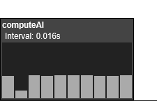

# ShrimpleProfiler



## What is this?

**ShrimpleProfiler** is a tool that allows s&box gamemode developers to measure the time it takes some piece of code to execute. This is crucial when you're trying to improve the performance!

## Features

 * Multiple measurements at the same time
 * No external dependencies

## Usage

### Getting started

 1. Include `fish.shrimpleprofiler` in your s&box project's settings -> Packages -> Package References
 2. Add an instance of panel `<ShrimpleProfiler.UI.ProfilerPanel></ShrimpleProfiler.UI.ProfilerPanel>` to your UI
 3. Add the following piece of code to your project:
 
```cs
using (new ShrimpleProfiler.Measure(resolution: 10, interval: 0.016))
{
	// your code goes here...
}
```

### API

#### ShrimpleProfiler.Measure.ctr

```cs
public Measure([CallerMemberName] string caller = "Unknown method", int resolution = 5, double interval = 0.05)
```

Measure the time it takes to execute the code.

Arguments:

 * `string caller` - name of the measurement. Automatically filled with the method's name if not provided.
 * `int resolution` - amount of bars in the chart
 * `double interval` - how often should we sample the performance

## Known issues

 * The measurements might be imprecise. Contributions are welcome.

## License

MIT. See [LICENSE.md](./LICENSE.md) for more info.